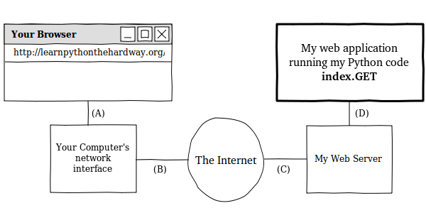

Exercise 51: Getting Input From A Browser
*****************************************

.. warning::

    This is a DRAFT of the exercise for the 2nd Edition of the book,
    it is not ready to be used yet but feel free to review it.

While it's exciting to see the browser display "Hello World", it's even
more exciting to let the user submit text to your application from
a form.  In this exercise we will improve our starter web application
using forms and storing information about the user into their "session"
so we can work with it.

How The Web Works
=================

Time for some boring stuff.  You need to understand a bit more about how the web
works before you can make a form.  This description isn't complete, but it is
accurate and will help you figure out what might be going wrong with your
application.  It will also make it easier for you to create forms if you know
what they do.

I'll start with a simple diagram that shows you the different parts of a web
request and how the information flows:

    

I've labeled the lines with letters so I can walk you through a regular request process:

1. You type in the url ``http://learnpythonthehardway.org/`` into your browser and it
   sends the request out on ``line (A)`` to your computer's network interface.
2. Your request goes out over the internet on ``line (B)`` and then to the remote
   computer on ``line (C)`` where my server accepts the request.
3. Once my computer accepts it, my web application gets it on ``line (D)``, and my
   Python code runs the ``index.GET`` handler.
4. The response comes out of my Python server when I ``return`` it, and goes back
   to your browser over ``line (D)`` again.
5. The server running this site takes the response off ``line (D)`` then sends it back
   over the internet on ``line (C)``.
6. The response from the server then comes off the internet on ``line (B)``, and your
   computer's network interface hands it to your browser on ``line (A)``.
7. Finally, your browser then displays the response.

In this description there's a few terms you should know so that you have a common
vocabulary to work with when talking about your web application:

Browser
    The software that you are probably using every day.  Most people don't
    know what it really does, they just call it "the internet".  It's job is to
    take addresses (like http://learnpythonthehardway.org) you type into the URL
    bar, and then use that information to make requests to the server at
    that address.

Address
    This is normally a URL (Uniform Resource Locator) like http://learnpythonthehardway.org/
    and which indicates where a browser should go.  The first part ``http`` indicates
    the protocol you want to use, in this case "Hyper-Text Transport Protocol".  You can
    also try ftp://ibiblio.org/ to see how "File Transport Protocol" works.  The ``learnpythonthehardway.org``
    part is the "hostname", or a human readable address you can remember and which maps
    to a number called an IP address, similar to a telephone number for a computer on the
    Internet.  Finally, URLs can have a trailing ``path`` like the ``/book/`` part of
    http://learnpythonthehardway.org/book/ and which indicates a file or some resource
    *on* the server to retrieve with a request.  There's many other parts, but those are
    the main ones.

Connection
    Once a browser knows what protocol you want to use (http), what server you want to 
    talk to (learnpythonthehardway.org), and what resource on that server to get, it
    must make a connection.  The browser simply asks your Operating System (OS) to open
    an "port" to the computer, usually port 80, and then when it works the OS hands
    back to your program something that works like a file, but is actually sending
    and receiving bytes over the network wires between your computer and the
    other computer at "learnpythonthehardway.org".  This is also the same thing
    that happens with http://localhost:8080/ but in this case you are telling
    the browser to connect to your own computer (localhost) and use port 8080
    rather than the default of 80.  You could also do http://learnpythonthehardway.org:80/
    and get the same result, except you're explicitly saying to use port 80 instead of
    letting it be that by default.

Request
    Your browser is connected using the address you gave, and now it needs to
    ask for the resource it wants (or you want) on the remote server.  If you
    gave ``/book/`` at the end of the URL then you want the file (resource)
    at /book/, and most servers will use the real file /book/index.html but
    pretend it doesn't exist.  What the browser does to get this resource is
    send a *request* to the server, over the connection, asking for it.  I won't
    get into exactly how it does this, but just understand that it has to 
    send something to query the server for it.  The interesting thing is that
    these "resources" don't have to be files, as is the case with your 
    application where the browser asks for something, but the server is
    returning something your Python code generated.

Server
    Now we get to the server, which is the computer at the end of a browser's
    connection that knows how to answer your browsers requests for files/resources.
    Most web servers just send files, and that's actually the majority of traffic.
    But you're actually building a server in Python that knows how to take 
    requests for resources, and then return strings that you craft using Python.
    When you do this crafting *you* are pretending to be a file to the browser,
    but really it's just code.  As you can see from Ex. 50, it also doesn't
    take much code to create a response.

Response
    This is your HTML (css, javascript, or images) that your server wants to
    send back to the browser as the answer to the browser's request.  In the case
    of files, it just reads them off the disk and sends them to the browser, but
    it wraps the contents of the disk in a special "header" so the browser knows
    what it's getting.  In the case of your application, you're still sending 
    the same thing, including the header, but you generate that data on the fly
    with your Python code.

That is the fastest crash course in how a web browser accesses information on servers
on the internet.  It should work well enough for you to understand this exercise, but
if not then I suggest going out and reading about it as much as you can until you get
it.  A really good way to do that is to take the diagram, and then break different parts
of the web application you did in Exercise 50.  If you can break your web application
in predictable ways using the diagram, then you'll start to understand how it works.

How Forms Work
==============

The best way to play with forms is to write some code that accepts
form data, and then see what you can do.  Take your ``bin/app.py``
file and make it look like this:

.. literalinclude:: ex/ex51/gothonweb/form_test.py
    :linenos:

Restart it (hit CTRL-c and then run it again) to make sure it loads
again, then go to this with your browser go to ``http://localhost:8080/hello``
which should display, "I just wanted to say Hello, Nobody."  Next, change
the URL in your browser to ``http://localhost:8080/hello?name=Frank`` and
you'll see it say "Hello, Frank."  Finally, change the ``name=Frank`` part
to be your name.  Now it's saying hello to you.

Let's break down the changes I made to your script to show you what's going on.

1. Instead of just a string for ``greeting`` I'm now using ``web.input`` to
   get data from the browser.  This function takes a key=value set of defaults,
   parses the ``?name=Frank`` part of the URL you give it, and then returns
   a nice object for you to work with that represents those values.
2. I then construct the ``greeting`` from the new ``form.name`` attribute of
   the ``form`` object, which should be very familiar to you by now.
3. Everything else about the file is the same as before.

You are also not restricted to just one parameter on the URL, try changing this
example to give two variables like this:
``http://localhost:8080/hello?name=Frank&greet=Hola``.  Then change the code to
get ``form.name`` and ``form.greet`` like this:

.. code-block:: python

    greeting = "%s, %s" % (form.greet, form.name)

After that change try the URL, and then also try leaving out the ``&greet=Hola``
part so that you can see the error you get.  Since ``greet`` doesn't have
a default value in ``web.input(name="Nobody")`` then it is a required field.
Now go back and make it have a default in the ``web.input`` call to see
how you fix this.  Another thing you can do is set its default to ``greet=None``
so that you can check if it exists and then give a better error message, like this:

.. code-block:: python
    
    form = web.input(name="Nobody", greet=None)

    if form.greet:
        greeting = "%s, %s" % (form.greet, form.name)
        return render.index(greeting = greeting)
    else:
        return "ERROR: greet is required."

Creating HTML Forms
===================

Passing the parameters on the URL works, but it's kind of ugly and 
not easy to use for regular people.  What you really want is a what's
called a "POST form".  This is a special HTML file that has a ``<form>``
tag in it.  This form will collect information from the user, then
send it to your web application just like you did above.

Let's make a quick one so you can see how it works.  Here's the new HTML
file you need to create, in ``templates/hello_form.html``:

.. literalinclude:: ex/ex51/gothonweb/templates/hello_form.html
    :linenos:

You should then change ``bin/app.py`` to look like this:

.. literalinclude:: ex/ex51/gothonweb/post_form.py
    :linenos:

Once you've got those written up, simply restart the web application
again and hit it with your browser like before.

This time you'll get a form asking you for "A Greeting" and "Your Name".
When you hit the ``Submit`` button on the form, it will give you the
same greeting you normally get, but this time look at the URL in your
browser.  See how it's ``http://localhost:8080/hello`` even though
you sent in parameters.

The part of the ``hello_form.html`` file that makes this work is the
line with ``<form action="/hello" method="POST">``.  This tells your
browser to:

1. Collect data from the user using the form fields inside the form.
2. Send them to the server using a ``POST`` type of request, which is
   just another browser request that "hides" the form fields.
3. Send that to the ``/hello`` URL (as shown in the ``action="/hello"`` part).

You can then see how the two ``<input>`` tags match the names of the variables
in your new code.  What you should also notice about this code is instead
of just a ``GET`` method inside ``class index``, I have another method ``POST``.

How this new application works is:

1. The browser first hits the web application at ``/hello`` but it sends a 
   ``GET``, so our ``index.GET`` function runs and returns the ``hello_form``.
2. You fill out the form in the browser, and the browser does what the ``<form>``
   says and sends the data as a ``POST``.
3. The web application then runs the ``index.POST`` method rather than the
   ``index.GET`` method to handle this request.
4. This ``index.POST`` method then does what it normally does to send 
   back the hello page like before.  There's really nothing new in 
   here, it's just moved into a new function.

As an exercise, go into the ``templates/index.html`` file and add a
link *back* to just ``/hello`` so that you can keep filling out the form
and seeing the results.  Try to make sure you can explain how this link
works and how it's letting you cycle between ``templates/index.html`` and
``templates/hello_form.html`` and what is being run inside this latest
Python code.

Creating A Layout Template
==========================

When you work on your game in the next Exercise, you'll need to make a
bunch of little HTML pages.  It will quickly become tedious to write a
full web page every time, so there's a way to create a "layout" template.
This layout template is kind of a shell that will wrap all your other pages
with common headers and footers that your HTML pages need.  Good programmers
try to reduce repetition, so layouts are essential for being a good programmer.

Change ``templates/index.html`` to be like this:

.. literalinclude:: ex/ex51/gothonweb/templates/index_laid_out.html
    :linenos:

Then change ``templates/hello_form.html`` to be like this:

.. literalinclude:: ex/ex51/gothonweb/templates/hello_form_laid_out.html
    :linenos:

All we're doing is stripping out the "boilerplate" at the top and the
bottom which is always on every page.  We'll put that back into a
single ``templates/layout.html`` file that handles it for us from
now on.

Once you have those changes, create a ``templates/layout.html`` file
with this in it:

.. literalinclude:: ex/ex51/gothonweb/templates/layout.html
    :linenos:

This file looks like a regular template, except that it's going to be
passed the *contents* of the other templates and used to *wrap* them.
Anything you put in here doesn't need to be in the other templates.
You should also pay attention to how ``$:content`` is written, since
it's a little different from the other template variables.

The *final* step is to change the line that makes the ``render`` object to
be this:

.. code-block:: python

    render = web.template.render('templates/', base="layout")

Which tells ``lpthw.web`` to use the ``templates/layout.html`` file as the
*base* template for all the other templates.  Restart your application and
then try to change the layout in interesting ways, but without changing the
other templates.

Writing Unit Tests For Forms
============================

It's easy to test a web application with your browser by just hitting refresh,
but come on, we're programmers here.  Why do some repetitive task when we can
just write some code to test our application?  What you're going to do next is
write a small little test that tests your web application form...

.. note:: Coming soon. I have to figure out how to teach this.

Extra Credit
============

1. Create a separate new project and make a simple number guessing game that creates a
   random number, and then asks the person until they get the number right or give up.
2. Write unit tests for this game too, as practice for doing the unit testing.
3. Read even more about HTML, and try to make the single room game have a better or
   at least different layout.  It helps to draw what you want to do on paper and *then*
   implement it with HTML.
4. This one is hard, but try to figure out how you'd do a file upload form so that you can
   upload an image and save it to the disk.
5. This is even more mind numbing, but go find the HTTP RFC (which is the document that
   describes how HTTP works) and read as much of it as you can.  It is really boring, 
   but comes in handy once in a while.
6. This will also be really difficult, but see if you can find someone to help you setup
   a web server like Apache, Nginx, or thttpd.  Try to serve a couple of your .html
   and .css files with it just to see if you can.  Don't worry if you can't, web servers
   kind of suck.
7. Make the sample python code that crafts GET requests in "How Forms Work" properly URL
   encode the URL.

